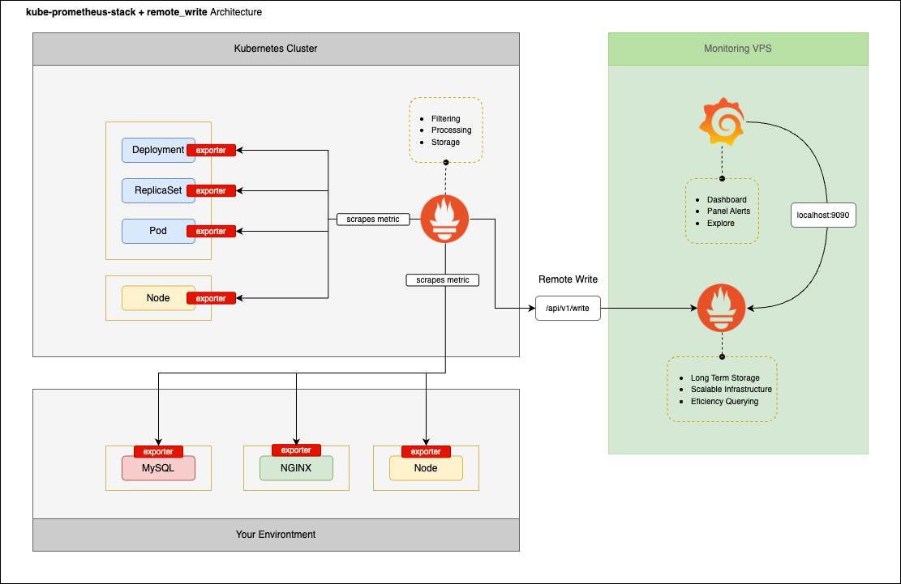

# biznetgio-webinar-monitoring

## Topology
kube-prometheus-stack + remote_write Architecture


## Preparation Server
Neo Lite VPS


Order on <a href="https://portal.biznetgio.com/" target="_blank">Portal Biznetgio</a>.
```
OS: Ubuntu 22.04
Flavor: MS 4.2
CPU: 2 vCPU
RAM: 4 GB
Disk: 60 GB
```

Access to VM Ubuntu via ssh for linux os host
```
ssh -l rydrafi 103.x.x.x -i name-xxx.key
```

login as super user
```
sudo su
```

set hostname
```
hostnamectl set-hostname monitoring
```

set timezone
```
timedatectl set-timezone Asia/Jakarta
```

Update and Upgrade package
```
apt update -y && apt upgrade -y
```

## Install Prometheus Server
Create user and change ownership prometheus data directory
```
sudo useradd -M -U prometheus
mkdir -p  /var/lib/prometheus_data/
chown prometheus:prometheus -R /var/lib/prometheus_data/
```

Download Prometheus Server Binary File
```
curl -LO https://github.com/prometheus/prometheus/releases/download/v2.53.4/prometheus-2.53.4.linux-amd64.tar.gz
```

Extract prometheus binary file
```
tar -zxvf prometheus-2.53.4.linux-amd64.tar.gz 
mv -v prometheus-2.53.4.linux-amd64 /opt/prometheus
chown prometheus:prometheus -R /opt/prometheus/
```

vim /etc/systemd/system/prometheus.service
```
[Unit]
Description=Prometheus Server
Documentation=https://prometheus.io/docs/introduction/overview/
After=network-online.target

[Service]
User=prometheus
Group=prometheus
Restart=on-failure
ExecStart=/opt/prometheus/prometheus \
  --config.file=/opt/prometheus/prometheus.yml \
  --storage.tsdb.path=/var/lib/prometheus_data/ \
  --storage.tsdb.retention.time=30d \
  --web.enable-remote-write-receiver

[Install]
WantedBy=multi-user.target
```

Reload daemon
```
sudo systemctl daemon-reload
```

Start and check service prometheus
```
sudo systemctl start prometheus.service
sudo systemctl enable prometheus.service
sudo systemctl status prometheus.service
sudo journalctl -u prometheus.service -f
```

Access prometheus dashboard


Check prometheus remote write receiver was enable


## Config prometheus basic authentication
To generate password on here <a href="https://bcrypt.online/" target="_blank">Bcrypt Hash Generator</a>.

Create authentication file
```
vim /opt/prometheus/auth.yml
```

/opt/prometheus/auth.yml
```
#change password and generate with hash
basic_auth_users:
      admin: $2y$12$tNkP/iiB78RggLeDjhTp6OLRcWh.EvicV5ZKV.qItZhxInhVGoUWK
```

Check validation auth file
```
/opt/prometheus/promtool check web-config /opt/prometheus/auth.yml
```

Enable Prometheus API basic authentication
```
vim /etc/systemd/system/prometheus.service
```

/etc/systemd/system/prometheus.service
```
[Unit]
Description=Prometheus Server
Documentation=https://prometheus.io/docs/introduction/overview/
After=network-online.target

[Service]
User=prometheus
Group=prometheus
Restart=on-failure
ExecStart=/opt/prometheus/prometheus \
  --config.file=/opt/prometheus/prometheus.yml \
  --storage.tsdb.path=/var/lib/prometheus_data/ \
  --storage.tsdb.retention.time=30d \
  --web.enable-remote-write-receiver \
  --web.config.file=/opt/prometheus/auth.yml #add

[Install]
WantedBy=multi-user.target
```

Reload daemon
```
sudo systemctl daemon-reload
```

Restart prometheus
```
systemctl restart prometheus.service
```

Edit prometheus config file to use basic auth
```
vim /opt/prometheus/prometheus.yml
```

/opt/prometheus/prometheus.yml
```
scrape_configs:
  - job_name: "prometheus"

    #add this
    basic_auth:
      username: "admin"
      password: "password"

    static_configs:
      - targets: ["localhost:9090"]
```

Check validation prometheus config file
```
/opt/prometheus/promtool check config /opt/prometheus/prometheus.yml
```

Restart prometheus
```
systemctl restart prometheus.service
```

## Install Grafana Server
Install prequisite tools
```
sudo apt-get install -y apt-transport-https software-properties-common wget
```

Setup Grafana repository
```
sudo mkdir -p /etc/apt/keyrings/
wget -q -O - https://apt.grafana.com/gpg.key | gpg --dearmor | sudo tee /etc/apt/keyrings/grafana.gpg > /dev/null
echo "deb [signed-by=/etc/apt/keyrings/grafana.gpg] https://apt.grafana.com stable main" | sudo tee -a /etc/apt/sources.list.d/grafana.list
```

Install Grafana
```
sudo apt-get update
sudo apt-get install grafana
```

Start and Check Grafana Server
```
systemctl enable grafana-server --now
systemctl status grafana-server
```

Access grafana dashboard


Grafana dashboard


Grafana add datasource connection


Grafana config prometheus connection


Grafana config prometheus connection test and save


## Setup kube-prometheus-stack on cluster
### Install Helm package manager
Install helm binary file
```
curl -fsSL -o get_helm.sh https://raw.githubusercontent.com/helm/helm/main/scripts/get-helm-3
chmod 700 get_helm.sh
./get_helm.sh
```

### Setup kube-prometheus-stack with helm
Add repo prometheus community on helm
```
helm repo add prometheus-community https://prometheus-community.github.io/helm-charts
helm repo update
```

Create directory kube-prometheus-stack deployment
```
mkdir kube-prometheus-stack
cd kube-prometheus-stack
```

Create custom config kube-prometheus-stack deployment
```
vim values.yaml
```

values.yaml
```
prometheus:
  prometheusSpec:
    scrapeInterval: "1m"
    retention: 1d
    remoteWrite:
    - url: http://103.x.x.x:9090/api/v1/write
      basicAuth:
          username:
            name: kubepromsecret
            key: username
          password:
            name: kubepromsecret
            key: password
grafana:
  enabled: false
alertmanager:
  enabled: false
```

Create namespace and secret for basicAuth login prometheus remoteWrite
```
kubectl create ns monitoring
kubectl create secret generic kubepromsecret --from-literal=username=admin --from-literal=password=password -n monitoring
```

Install kube-prometheus-stack
```
helm install -n monitoring kube-prometheus-stack prometheus-community/kube-prometheus-stack --create-namespace -f values.yaml
```

Create custom config prometheus job for external cluster node
```
vim external-node.yaml
```

external-node.yaml
```
prometheus:
  prometheusSpec:
    additionalScrapeConfigs:
      - job_name: "external-node-exporter"
        static_configs:
          - targets:
            - "10.10.10.x:9100"
            - "10.10.10.x:9100"
```

Upgrade helm kube-prometheus-stack deployment
```
helm upgrade -n monitoring kube-prometheus-stack prometheus-community/kube-prometheus-stack -f external-node.yaml --reuse-values
```
